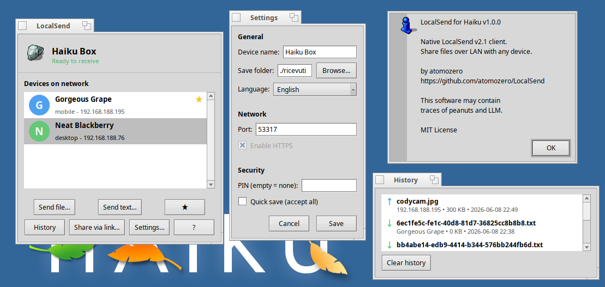

# LocalSend for Haiku

Native Haiku client for the LocalSend: share files and text messages over LAN with any device (Android, iOS, Windows, macOS, Linux) running LocalSend, without internet and without third-party servers.



If LocalSend for Haiku saves you time, consider supporting development: [](https://buymeacoffee.com/atomozero)


## Features

* Native Haiku GUI and CLI clients
* Secure HTTPS transfers with self-signed TLS certificates
* Automatic LAN device discovery via multicast
* Send files and text messages to any LocalSend-compatible device
* Share files through browser-downloadable links
* Drag & drop support and Tracker context-menu integration
* Favorites, transfer history, notifications, and PIN protection
* BFS MIME type integration for received files
* Parallel file uploads for improved performance
* Localized in English, Italian, Japanese, Chinese, and Spanish
* No external dependencies beyond Haiku system libraries and OpenSSL

## Quick start

### GUI (recommended)

```
make
./LocalSend
```

The GUI window shows discovered devices on the LAN. Select a device and:
- Click **"Send file..."** to send files (or drag files onto the window)
- Click **"Send text..."** to send a text message
- Click **"Share via link..."** to generate a browser-downloadable link
- Click **★** to add/remove a device from favorites

Incoming transfers show an accept/reject dialog (favorites are auto-accepted).

### Tracker integration

```
make install-addon
```

Right-click any file in Tracker → Add-ons → **"Send with LocalSend"**.

### CLI

**Send files:**
```
./localsend-send <host> <file> [file...] [--pin PIN] [--port PORT] [--alias NAME]
```

**Receive files:**
```
./localsend-receive [--dir FOLDER] [--port PORT] [--alias NAME] [--pin PIN] [--auto]
```

## Build

Requires Haiku with GCC, OpenSSL (`openssl_devel`), and standard system
libraries (`libbe`, `libnetwork`, `libtracker`).

```
make                 # builds everything: GUI, CLI tools, Tracker add-on
make install-addon   # installs Tracker context menu add-on
make test-receive    # runs protocol-level unit tests
make clean           # removes all build artifacts
```

## Be careful
> **Developer's Note**: This software may contain traces of peanuts and LLM. It has been developed with passion for the Haiku platform.

## Support

If you find this project useful, you can buy me a coffee: [](https://buymeacoffee.com/atomozero)
